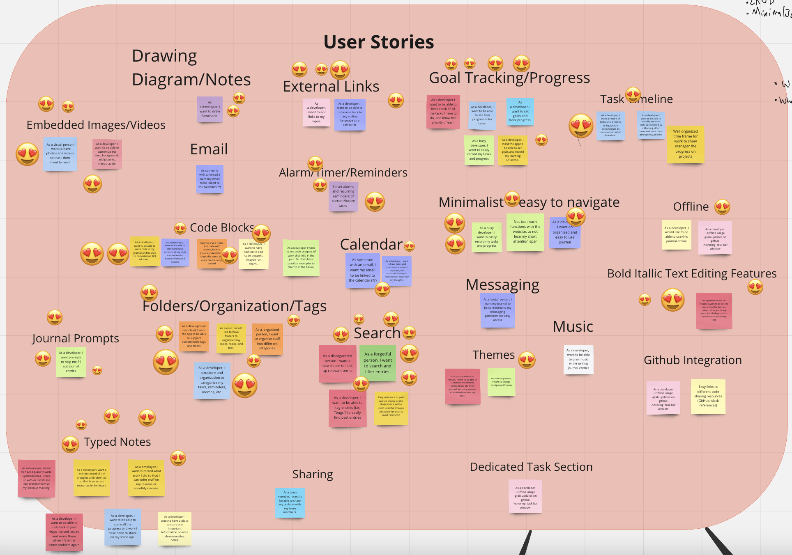
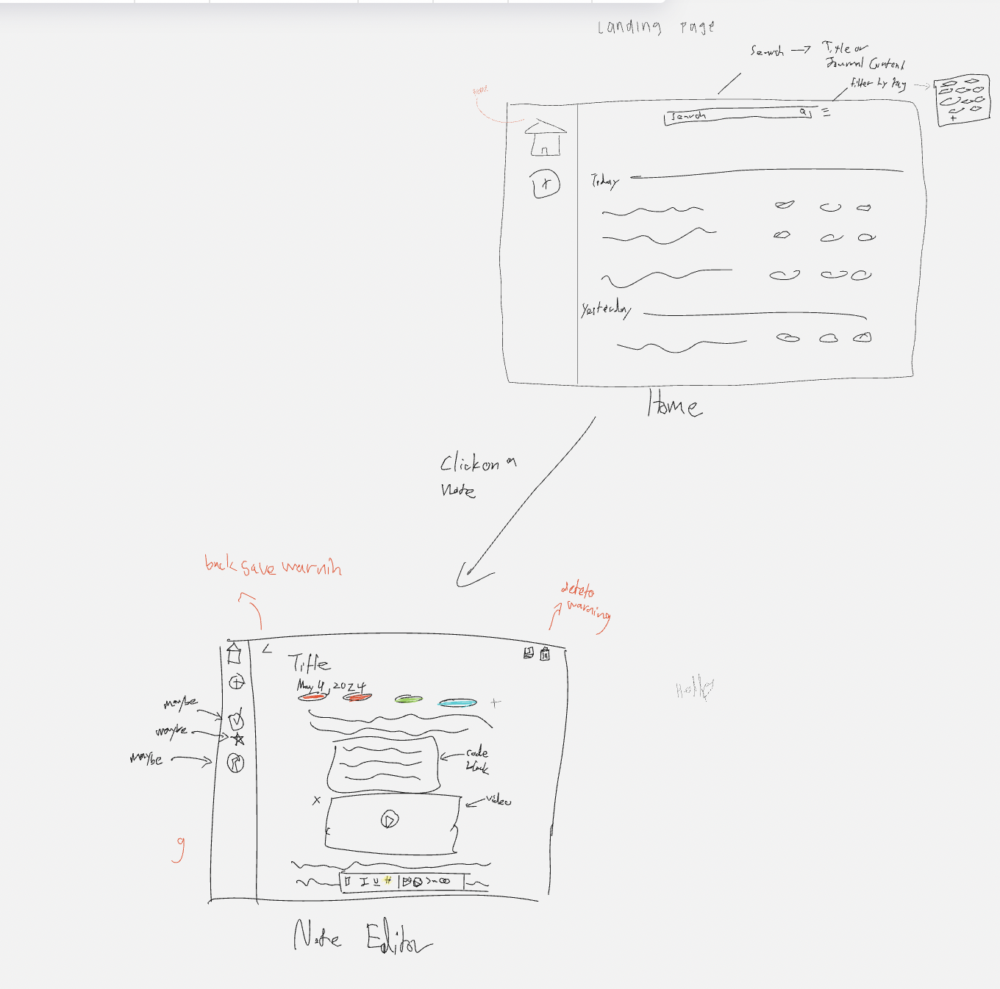

# Team 24 Project Pitch

## Group Identification

**Team Number:** 24
 
**Team Name:** Computer PAWgrammers
 
**Team Members:**
Ishaan Kale,
Cynthia Delira,
David Choi,
Eugenie Ren,
Harsh Gurnani,
Jeffrey Lee,
Kiera Navarro,
Sarvesh Mann,
Terence Tan,
Sofia Nguyen,
Geena Limfat

## Statement of Purpose

To create a Dev Journal that allows for note-taking (include images, videos, and tags), write code, delete, save, searching. By maintaining a journal, developers can track their progress and identify areas for improvement.

## User Personas

**User Persona: Avery**

- I am a new developer, 18 years old.
- Aspiration programmer who wants to improve, thinks using a dev journal will help them reach this goal.

**Wants/Needs**

- want to jot down short notes related to their projects such as attempted code and next steps to resolve bugs
- mostly will be used for programming assignments
- not much of a visual person
- Doesn't want to spend too much time getting used to a new app layout

**Personality**

- Experienced with technology and trendy UIs.
- Patient, willing to explore, but there is a limit.
- Doesn't consider themselves to be artsy but can appreciate nice layouts and colors
- Tends to be forgetful

  
**User Persona: Alex**

- I am a seasoned developer with over 10 years of experience in the field.
- Passionate about mentoring junior team members and creating a culture of continuous learning.

**Wants/Needs**

- Seeks a platform to share insights and document best practices.
- Wants simplicity and efficiency in the journaling process.
- Prefers a straightforward interface to log daily experiences quickly and easily.
- Needs the ability to categorize entries and track progress over time.

**Personality**

- Analytical and methodical in approach.
- Appreciates functionality over aesthetics but knows the importance of a clean and intuitive user interface.
- Strives for efficiency and effectiveness in all aspects of work.
- Enjoys problem-solving and finding creative solutions to challenges.

**User Persona: Derick**

- I am a 16 year old highschooler who is looking to get into Computers
- Want something simple that even a novice can use

**Wants/Needs**

- want a easy to use website
- looking for something to help study computers
- offline usage, as at home the wifi is not as good
- efficent as his device is not the lastest tech

**Personality**

- prefer something minimalistic
- prefers something to run on his old 2016 laptop
- prefers to have it being within reachability(no wifi, loads fast)

**User Persona: Emily**

- I am a senior development manager
- Oversees plamnning, execution, and delivery of products

**Wants/Needs**

- Wants to keep an organized place with all the notes from different meetings
- Wants to personalize his own tagging of different notes
- Needs an efficient note taking application that saves his notes but can also return to edit
- Needs an efficient way to return to look back at previous notes from previous meetings

**Personality**

- Organized and prefers minimalism
- Has so many meetings with different clients and teams throughout a single day
- Has a busy schedule

**User Persona: Raj**

- I am a graduate student researcher working on a novel bioinformatics tool.
- I love to develop new technologies that have not been done before.

**Wants/Needs**

- Since he works on new problems, Raj faces a lot of issues that haven't been solved before and wants a place to document their solutions.
- Requires a place to document data analysis results to present later
- Wants a way to filter journal entries based on low, medium, and high priority
- Prefers a simple UI that allows for very quick notes and journal entry opening.

**Personality**

- Actively involves himself in many different projects with various faculty members
- Takes very short and quick notes regularly while working
- Enjoys experimental work and researching innovative ideas

**User Persona: Draymond**

- I am a retired basketball player looking to start a personal CS project
- Currently starting off alone, but looking to add other interested people

**Wants/Needs**

- Needs a place to track progress of project brainstorming, planning, and coding
- Wants to keep things organized and easy to work with to help with future onboarding of new workers
- Does not want application to get in the way of work and take up unnecessary time

**Personality**

- Aggressive and assertive in his beliefs
- Very articulate and likes to explain his thoughts thoroughly
- Enjoys taking on new hobbies and tasks that intrigue

**User Persona: Jade**

- Manager
- Looking for a DevJournal that will keep her better organized
- Doesn’t know the fine details about coding but manages a software team

**Wants/Needs**

- Easy access to resources
  - Coding references
- Needs to keep note of team meetings
  - Standups
  - Brainstorming
- Needs to keep all her pitches/rundowns in one place

**Personality:**

- Straight to the point
- Minimalist
- Organized
- Easily Distracted

**User Persona: Margaret**

- I am a 51 year old high school teacher who teaches an intro to programming class.
- I love creating interesting programming assignments for my students.

**Wants/Needs**

- Wants a journal to keep entries about her personal and work life.
- Needs a place to organize the programming assignments for her class and label them accordingly.

**Personality**

- Less tech-savvy.
- Enjoys simplicity and ease of use in apps.

## Problems

- Developers face challenges in documenting their progress with everyday and long term tasks, as there is no good centralized way to record both code snippets and regular documentation. Existing solutions don't cater towards the specifc functionality that developers are looking for in their note-taking or journaling applications.
- Oftentimes, developers face bugs/issues that show up repeatedly and are not simple to fix. Even after finding a solution, there is not a good way for them to record how they solved the problem, leading to much unnecessary stress of trying to resolve it when they face the issue again. Similarly, it is currently difficult to access old code that may be useful or reusable.
- Furthermore, it is hard to keep track of work-related resources (i.e. Github links, StackOverflow, etc), since there are so many links and resources and no way to organize everything.
- These pain points are ubiquitous across the developer community. We want to propose a solution that addresses these problems and makes work life simpler for developers, to drive productivity and project success.

## Appetite

- Considering that our timeline is only 4ish weeks, we should be cautious about the features we commit to
- The work should be communicated and split up in a clear way. We should understand which features depend on each other so that we don't get stuck with a dependency
- We should prioritize the most important features first, and then reevaluate our other ideas
- We should aim to complete the prototype within _2 weeks_ to allow enough time for testing, style, etc
- We should always allow a "buffer time" for unforseen issues. The final week should be focused on wrapping up the work (rather than rushing other features)
- We should try to meet up at least once per week in person, small groups or all together. This would help resolve isues of communication and staying on track. We might have issues with coordinating everyone's schedules, so small groups might be ideal.

## Brainstorming

Our team largely brainstormed using [this Miro board](https://miro.com/app/board/uXjVKNcw5I4=/).

### User stories

We started off the brainstorming process by creating a lot of user stories (around 4 per team member), shown in the image below. Each user story was categorized according to a specific feature that we could implement in our developer journal web app. Finally, we voted on our favorite features that we thought would be the most high priority to include in our CRUD app. Creating user stories really helped us identify the main pain points that users currently face so that we could prioritize creating an app that could provide a strong user experience. The chosen features based on our voting will be used as issues during the actual project, which will help with organization and establishing a development timeline.

### UI Development

We divided into smaller groups to brainstorm ideas for the UI that we wanted to create. While going through this process, we surveyed other ‘competitors’ apps that had aspect that we liked and wanted to include. The small group sessions resulted in many different ideas for how we wanted our UI to look, and each group had good solutions included in their UI to solve the main problems we outlined above. For example, we all voted to have a separate page pop up for each journal entry upon it being clicked. In the end, we took a vote to decide on the UI we liked the most and the small features from each one that we wanted in the final product, and used these to build up a final user interface that we drew together as a team (an image of which is shown in the Solution section below).

## Solution

### Current UI Design

Need to narrow down the core features for note-taking.
Suggestions (in order from critical to lesser):

1. contain multiple notes displayed in chronological order
2. Search Filtering (organization)
   - create a search filter that will only display notes that are filtered by tags and title
   - also filters by all text context in the note
3. titles and dates for notes
   - Title and date set as attribute in note object (date default set as day note was added)
4. tagging
    - Allow user to create tags for notes to make searching for specific notes possible
5. edit/save/delete note (with warning)
    - Button for edit, save, and delete should be connected to the actual note
6. hovering tool bar functions for editing notes (italicize, bold, images, etc)
   - Tool bar pops up when editing different notes
   - insert/ delete code blocks, images, videos, external links are also options in this tool bar 
7. Has a side bar with a home button and an add button for a new task (in order to navigate between new notes and current available notes)

## Technology

1. Html, CSS, Javascript for creating the website
2. Git 4 version control
3. Github for collaberation
4. Miro team brainstorming
5. Slack communitcating
6. Zoom for meetings

## Unit Testing:
- Use jest & pupeteer 
- Unit testing parallelly with development
  
## Database:
- Using electron and the users local file system

## Timeline:
**Week 7**
- (Only 1 note) MVP finished
    - Electron + File Storage(3ppl) (Figure out electron)
    - API /Structure(4ppl) (make a basic api to process note data and decide on the structure of that note data)
    - Editing/Text(4 people)
        - UI/html structure
        - Process the text

**Week 8** (multi note is done by May 25th)
- Implementing the home
- Multiple notes

**Week 9** (Fix any egregious bugs) ← A DONE PROJECT
- Bug fixs

**Week 10**
- Additional features (TBD)

**Week 11**
- Final wrapup (TBD)
  

## Non-functional features:
  - Performance:
    - Faster than 3 seconds (the average load time on desktop on google)
  - Accessibility:
    - Accessible color palette (color blind friendly)
    - Screen reader compatibility
    - Using electron.js so only local to computer   

## Rabbit Holes/Risk Analysis

Avoid complexity and to achieve minimalism, we all need to work with a basic skeleton of the notes. Perhaps we can transfer the add/delete function from our warm-up exercise and make it our skeleton. Last time, our tasks were too dependent on each other and we had long waiting times.
Here's a potential skeleton:

- (https://www.youtube.com/watch?v=gvtxYX4sw08 - html - part1)
- (https://www.youtube.com/watch?v=dM4edrhLEjM - part2)
- (https://youtu.be/HdHk1SaL5M0?feature=shared&t=199 - part3 - has nice outline of js functions)

### What Else We Learned from Last Time

- Focusing on the small details that may not cause too big of a difference instead of looking at the overall project
- Focusing too much time on adding new features instead of making sure the basic ones are well implemented
- Exploring new tech in limited timeframe
- Not communicating well with other teams on what they’re doing, how they’re implementing, the progress they’ve made, any issues
- Don’t get overeager with how much we accomplish and try to do more than we can handle in the given time frame
- Not documenting enough on our progress
- Waiting for whole group meetings to discuss next steps
  - Can discuss in slack/in smaller groups

## No Gos

- no auto save
- no keyboard shortcuts
- no implementation of an IDE
- no music
- no email/ Google calendar sync
- no timer/alarms
- not tracking progress of tasks
- no sharing function for notes
